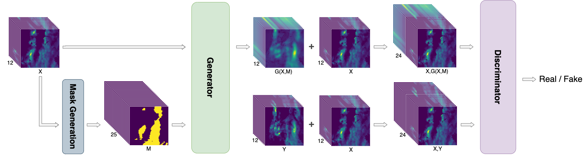
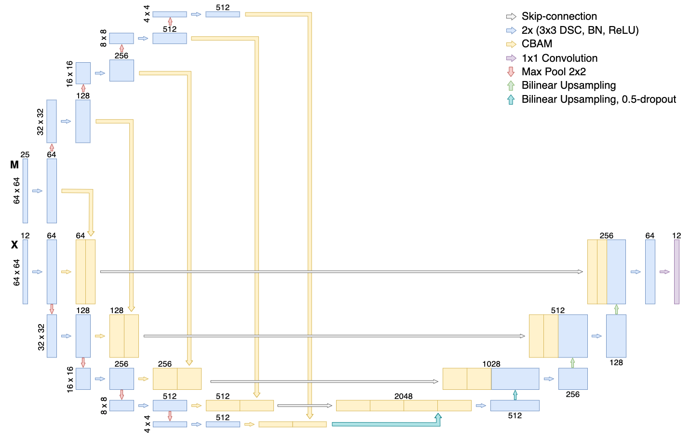

# GA-SmaAt-GNet
PyTorch code for the Paper "GA-SmaAt-GNet: Generative Adversarial Small Attention GNet for Extreme Precipitation Nowcasting"





The proposed GA-SmaAt-GNet's generator architecture (SmaAt-GNet) can be found in the model folder in [unet_precip_regression_lightning.py](models/unet_precip_regression_lightning.py). The discriminator architecture can be found in [discriminator.py](models/discriminator.py)

The code in this GitHub is based on the code of the SmaAt-UNet model which can be found at https://github.com/HansBambel/SmaAt-UNet

## Installing dependencies
This project is using [poetry](https://python-poetry.org/) as dependency management. Therefore, installing the required dependencies is as easy as this:
```shell
conda create --name smaat-unet python=3.9
conda activate smaat-unet
poetry install
# Sadly poetry < 1.5 does not allow to install the GPU variant so you need to do that afterwards separately:
pip3 install torch torchvision torchaudio --force-reinstall --index-url https://download.pytorch.org/whl/cu118
```

A [requirements.txt](requirements.txt) is also added from the poetry export.

The following requirements are needed:
```
tqdm
torch
lightning
tensorboard
torchsummary
h5py
numpy
grad-cam
```

---
For the paper we used [Pytorch-Lightning](https://github.com/Lightning-AI/lightning) which simplifies the training process and allows easy additions of loggers and checkpoint creations.

If you have any questions about the code you can write an email to e.reulen@students.uu.nl and s.mehrkanoon@uu.nl.

### Training
An example training script [train_moving_mnist.py](train_moving_mnist.py) is provided which trains the GA-SmaAt-GNet model on the [Moving MNIST](https://www.cs.toronto.edu/~nitish/unsupervised_video/) dataset. Running this script will automatically download the dataset. 

For training on the precipitation data the [train_precip.py](train_precip.py) file can be used. Make sure that the model you want to train is correctly specified in the model parameter of the script.
The training will save a checkpoint file for the top 3 best epochs in the directory specified with the `default_save_path` variable.

The [test_precip.py](test_precip.py) can be used to calculate the permormance of the trained model on the test set by providing the location of the checkpoint file with the lowest validation loss and model name in the script. The results will be saved as .csv in the specified results folder.
Pretrained checkpoint files of the models discussed in the paper are available upon request. Please write an email to: s.mehrkanoon@uu.nl.

### Extreme Precipitation dataset
The data consists of 25 years precipitation maps in 5-minute intervals from 1998-2022 with a 2.4km grid. 

The dataset is based on radar precipitation maps from the [The Royal Netherlands Meteorological Institute (KNMI)](https://www.knmi.nl/over-het-knmi/about). The original images were cropped as can be seen in the example below:


If you are interested in the extreme precipitation dataset we used, please write an email to: s.mehrkanoon@uu.nl.


We normalized the data using [Min-Max normalization](https://en.wikipedia.org/wiki/Feature_scaling#Rescaling_(min-max_normalization)). In order to revert this you need to multiply the images by 52.52; this results in the images showing amount of rain in mm/5min.

### Grad-CAM
We used Grad-CAM to generate activation heatmaps for different parts of GA-SmaAt-GNet to gain more insight into our model's predictions. These activation heatmaps can be generated by running the [grad-cam.py](grad-cam.py) script. The code in this script was obtained from [https://github.com/mathieurenault1/SAR-UNet/blob/master/cam_segmentation_precip.py](https://github.com/mathieurenault1/SAR-UNet/blob/master/cam_segmentation_precip.py) and modified for our model and dataset.

### Citation
```
@misc{reulen2024gasmaatgnet,
      title={GA-SmaAt-GNet: Generative Adversarial Small Attention GNet for Extreme Precipitation Nowcasting}, 
      author={Eloy Reulen and Siamak Mehrkanoon},
      year={2024},
      eprint={2401.09881},
      archivePrefix={arXiv},
      primaryClass={cs.LG}
}
```
